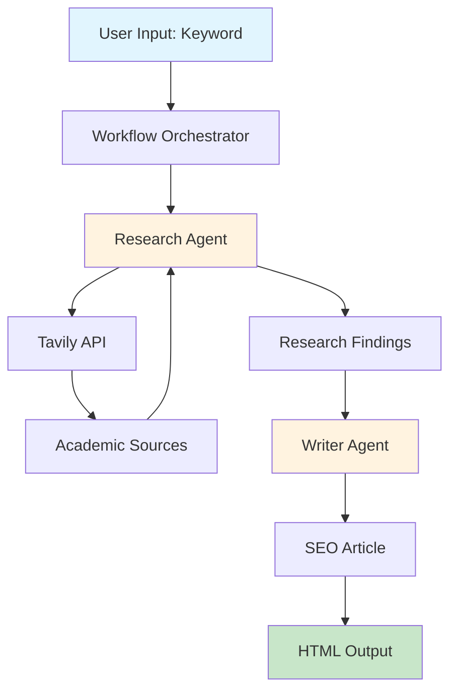

# SEO Content Automation System

An intelligent content generation pipeline that researches keywords using academic sources and produces SEO-optimized articles ready for human review. Built with PydanticAI for structured AI outputs and async Python for efficient API integration.

## 🎯 Project Overview

This system automates the content creation workflow by:
1. **Researching** keywords using academic sources via Tavily API
2. **Analyzing** credible sources with structured AI agents
3. **Generating** SEO-optimized articles based on research findings
4. **Producing** HTML drafts with metadata for human review

The project emphasizes code quality, error handling, and modular design while serving as a learning platform for async Python and AI agent development.

## 🏗️ Architecture



### Key Components

- **Research Agent**: Uses PydanticAI to analyze academic sources and extract key insights
- **Writer Agent**: Transforms research into SEO-optimized content with proper structure
- **Workflow Orchestrator**: Manages the pipeline and handles errors gracefully
- **Tavily Integration**: Provides access to academic and credible web sources
- **Output Manager**: Generates organized HTML drafts with research metadata

## 🚀 Quick Start

### Prerequisites

- Python 3.11 or higher
- API Keys:
  - [Tavily API Key](https://tavily.com) for web search
  - [OpenAI API Key](https://platform.openai.com) for content generation

### Installation

1. **Clone the repository**
   ```bash
   git clone https://github.com/yourusername/seo-content-automation.git
   cd seo-content-automation
   ```

2. **Create a virtual environment**
   ```bash
   python -m venv venv
   source venv/bin/activate  # On Windows: venv\Scripts\activate
   ```

3. **Install dependencies**
   ```bash
   pip install -r requirements.txt
   ```

4. **Configure environment variables**
   ```bash
   cp .env.example .env
   # Edit .env with your API keys
   ```

5. **Run your first generation**
   ```bash
   python main.py generate "blood sugar management"
   ```

## 📋 Configuration

Create a `.env` file with the following variables:

```env
# Required API Keys
TAVILY_API_KEY=your_tavily_api_key_here
OPENAI_API_KEY=your_openai_api_key_here

# Output Configuration
OUTPUT_DIR=./drafts

# Optional Settings
LOG_LEVEL=INFO
MAX_RETRIES=3
REQUEST_TIMEOUT=30
```

## 💻 Usage

### Basic Usage

Generate an article for a single keyword:
```bash
python main.py generate "ketogenic diet benefits"
```

### Advanced Options

```bash
# Verbose output with debug information
python main.py generate "intermittent fasting" --verbose

# Specify custom output directory
python main.py generate "insulin resistance" --output-dir ./my-articles

# Check configuration
python main.py config check
```

### Output Structure

Each generation creates a timestamped directory:
```
drafts/
└── blood_sugar_management_20240115_143022/
    ├── index.html        # Review interface
    ├── article.html      # Generated article
    └── research.json     # Research metadata
```

## 🧩 Project Structure

```
seo_content_automation/
├── main.py              # CLI entry point
├── config.py            # Configuration management
├── workflow.py          # Pipeline orchestration
├── agents.py            # AI agents (Research & Writer)
├── tools.py             # API integrations
├── prompts/             # Prompt templates
│   └── article_template.txt
├── drafts/              # Generated articles
├── tests/               # Test suite
└── docs/                # Additional documentation
```

## 🛠️ Development

### Running Tests

```bash
# Run all tests
pytest

# Run with coverage
pytest --cov=.

# Run specific test file
pytest tests/test_agents.py
```

### Code Style

The project uses:
- Black for code formatting
- isort for import sorting
- mypy for type checking

```bash
# Format code
black .
isort .

# Type check
mypy .
```

### Adding New Features

1. Create a feature branch
2. Implement with tests
3. Update documentation
4. Submit pull request

## 📊 Example Output

The system generates comprehensive articles with:
- SEO-optimized title and meta description
- Structured content with proper headings
- Academic source citations
- 1,500-2,500 word count
- HTML formatting ready for CMS

## 🐛 Troubleshooting

### Common Issues

**API Key Errors**
- Verify keys are correctly set in `.env`
- Check API key permissions and quotas

**Network Timeouts**
- Increase `REQUEST_TIMEOUT` in `.env`
- Check internet connection
- Verify API service status

**No Academic Sources Found**
- Try broader keywords
- Check Tavily search parameters
- Review academic source filters

### Debug Mode

Enable detailed logging:
```bash
LOG_LEVEL=DEBUG python main.py generate "your keyword"
```

## 🤝 Contributing

We welcome contributions! Please:
1. Fork the repository
2. Create a feature branch
3. Add tests for new functionality
4. Ensure all tests pass
5. Submit a pull request

## 📚 Learning Resources

This project is designed as a learning platform for:
- **Async Python**: Master async/await patterns
- **PydanticAI**: Structured AI agent development
- **API Integration**: Best practices for external services
- **Error Handling**: Graceful degradation strategies
- **Testing**: Comprehensive test coverage

## 🔮 Future Enhancements

- [ ] Batch keyword processing
- [ ] WordPress integration
- [ ] Web UI with Streamlit
- [ ] Multi-language support
- [ ] SEO scoring metrics
- [ ] Content scheduling

## 📄 License

This project is licensed under the MIT License - see the [LICENSE](LICENSE) file for details.

## 🙏 Acknowledgments

- Built with [PydanticAI](https://ai.pydantic.dev/) for structured AI outputs
- Powered by [Tavily API](https://tavily.com) for academic research
- Uses [OpenAI](https://openai.com) for content generation

## 📞 Support

- Create an [issue](https://github.com/yourusername/seo-content-automation/issues) for bugs
- Check [PLANNING.md](PLANNING.md) for architecture details
- Review [TASKS.md](TASKS.md) for development roadmap

---

*Built with ❤️ for content creators who value quality and efficiency*