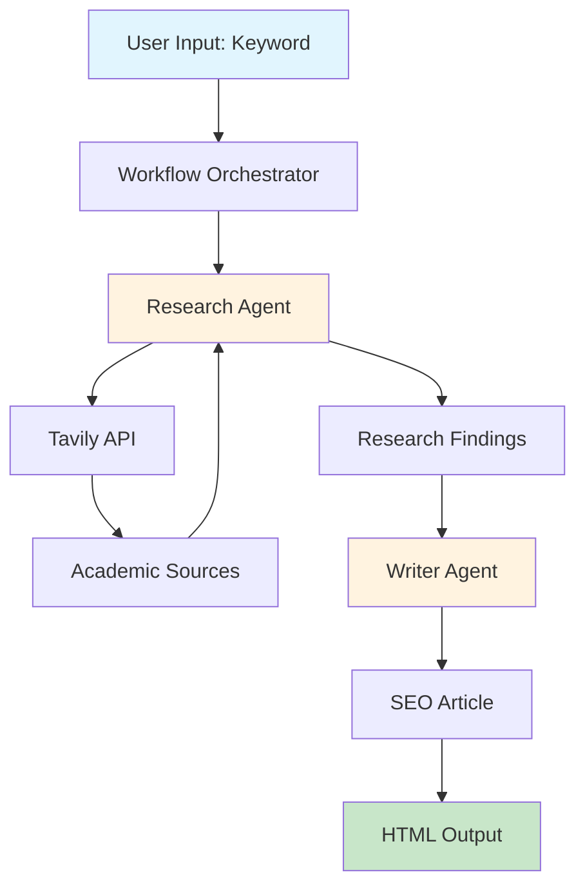

# SEO Content Automation System

An intelligent content generation pipeline that researches keywords using academic sources and produces SEO-optimized articles ready for human review. Built with PydanticAI for structured AI outputs and async Python for efficient API integration.


## 🎯 Project Overview

This system automates the content creation workflow by:
1. **Researching** keywords using academic sources via Tavily API
2. **Analyzing** credible sources with structured AI agents
3. **Generating** SEO-optimized articles based on research findings
4. **Producing** HTML drafts with metadata for human review

The project emphasizes code quality, error handling, and modular design while serving as a learning platform for async Python and AI agent development.

## 🏗️ Architecture



### Key Components

- **Research Agent**: Uses PydanticAI to analyze academic sources and extract key insights
- **Writer Agent**: Transforms research into SEO-optimized content with proper structure
- **Workflow Orchestrator**: Manages the pipeline and handles errors gracefully
- **Tavily Integration**: Provides access to academic and credible web sources
- **Output Manager**: Generates organized HTML drafts with research metadata

## 🚀 Quick Start

### Prerequisites

- Python 3.11 or higher
- API Keys:
  - [Tavily API Key](https://tavily.com) for web search
  - [OpenAI API Key](https://platform.openai.com) for content generation

### Installation

1. **Clone the repository**
   ```bash
   git clone https://github.com/yourusername/seo-content-automation.git
   cd seo-content-automation
   ```

2. **Create a virtual environment**
   ```bash
   python -m venv venv
   source venv/bin/activate  # On Windows: venv\Scripts\activate
   ```

3. **Install dependencies**
   ```bash
   pip install -r requirements.txt
   ```

4. **Configure environment variables**
   ```bash
   cp .env.example .env
   # Edit .env with your API keys
   ```

5. **Run your first generation**
   ```bash
   python main.py generate "blood sugar management"
   ```

## 📋 Configuration

### Environment Variables

Create a `.env` file in the project root:

```env
# Required API Keys
TAVILY_API_KEY=your_tavily_api_key_here
OPENAI_API_KEY=your_openai_api_key_here

# Output Configuration (Optional)
OUTPUT_DIR=./drafts              # Where to save generated articles
LOG_LEVEL=INFO                   # DEBUG, INFO, WARNING, ERROR
MAX_RETRIES=3                    # Number of retry attempts for API calls
REQUEST_TIMEOUT=30               # Timeout in seconds for API requests

# Model Configuration (Optional)
LLM_MODEL=gpt-4                  # OpenAI model to use

# Tavily Search Configuration (Optional)
TAVILY_SEARCH_DEPTH=advanced     # basic or advanced
TAVILY_MAX_RESULTS=10            # Maximum search results (1-20)
TAVILY_INCLUDE_DOMAINS=.edu,.gov,.org  # Prioritized domains
```

### Configuration Details

| Variable | Required | Default | Description |
|----------|----------|---------|-------------|
| `TAVILY_API_KEY` | ✅ | - | Your Tavily API key for web search |
| `OPENAI_API_KEY` | ✅ | - | Your OpenAI API key for content generation |
| `OUTPUT_DIR` | ❌ | `./drafts` | Directory for saving articles |
| `LOG_LEVEL` | ❌ | `INFO` | Logging verbosity |
| `MAX_RETRIES` | ❌ | `3` | API retry attempts |
| `REQUEST_TIMEOUT` | ❌ | `30` | API timeout in seconds |
| `LLM_MODEL` | ❌ | `gpt-4` | OpenAI model selection |
| `TAVILY_SEARCH_DEPTH` | ❌ | `advanced` | Search comprehensiveness |
| `TAVILY_MAX_RESULTS` | ❌ | `10` | Number of search results |
| `TAVILY_INCLUDE_DOMAINS` | ❌ | `.edu,.gov,.org` | Preferred source domains |

### Getting API Keys

1. **Tavily API Key**
   - Sign up at [tavily.com](https://tavily.com)
   - Navigate to API Keys section
   - Copy your API key

2. **OpenAI API Key**
   - Create account at [platform.openai.com](https://platform.openai.com)
   - Go to API Keys section
   - Generate new secret key
   - **Important**: Save immediately (shown only once)

## 💻 Usage

### Command Overview

```bash
python main.py --help  # Show all available commands
```

### Basic Article Generation

Generate an article for a single keyword:
```bash
python main.py generate "ketogenic diet benefits"
```

### Advanced Options

```bash
# Research only (no article generation)
python main.py generate "intermittent fasting" --dry-run

# Verbose output with debug information
python main.py generate "protein synthesis" --verbose

# Quiet mode (only output file path)
python main.py generate "muscle building" --quiet

# Custom output directory
python main.py generate "insulin resistance" -o ./my-articles

# Combine multiple options
python main.py generate "blood sugar" -o ./output --verbose
```

### Configuration Management

```bash
# Check if configuration is valid
python main.py config --check

# Show current configuration
python main.py config --show

# Test your setup with a sample generation
python main.py test
```

### Maintenance Commands

```bash
# Clean up old workflow files
python main.py cleanup

# Clean files older than 48 hours
python main.py cleanup --older-than 48

# Preview what would be cleaned (dry run)
python main.py cleanup --dry-run
```

### Output Structure

Each generation creates a timestamped directory:
```
drafts/
└── blood_sugar_management_20240115_143022/
    ├── index.html        # Review interface
    ├── article.html      # Generated article
    └── research.json     # Research metadata
```

## 🧩 Project Structure

```
seo_content_automation/
├── main.py              # CLI entry point
├── config.py            # Configuration management
├── workflow.py          # Pipeline orchestration
├── agents.py            # AI agents (Research & Writer)
├── tools.py             # API integrations
├── prompts/             # Prompt templates
│   └── article_template.txt
├── drafts/              # Generated articles
├── tests/               # Test suite
└── docs/                # Additional documentation
```

## 🛠️ Development

### Running Tests

```bash
# Run all tests
pytest

# Run with coverage
pytest --cov=.

# Run specific test file
pytest tests/test_agents.py
```

### Code Style

The project uses:
- Black for code formatting
- isort for import sorting
- mypy for type checking

```bash
# Format code
black .
isort .

# Type check
mypy .
```

### Adding New Features

1. Create a feature branch
2. Implement with tests
3. Update documentation
4. Submit pull request

## 📊 Example Output

The system generates comprehensive articles with:
- SEO-optimized title and meta description
- Structured content with proper headings
- Academic source citations
- 1,500-2,500 word count
- HTML formatting ready for CMS

## 🐛 Troubleshooting

### Common Issues

#### API Key Errors
```
❌ Configuration error: tavily_api_key cannot be empty
```
**Solution:**
- Verify `.env` file exists in project root
- Check API keys are correctly set without quotes
- Ensure no spaces around the `=` sign
- Verify API key format (usually 32+ characters)

#### Network Timeouts
```
TimeoutError: Request timed out after 30 seconds
```
**Solution:**
- Increase timeout: `REQUEST_TIMEOUT=60` in `.env`
- Check internet connection stability
- Verify API service status at:
  - Tavily: https://status.tavily.com
  - OpenAI: https://status.openai.com

#### No Academic Sources Found
```
ValueError: No academic sources found in research results
```
**Solution:**
- Try broader or more common keywords
- Remove special characters from keywords
- Check `TAVILY_INCLUDE_DOMAINS` setting
- Try with `TAVILY_SEARCH_DEPTH=advanced`

#### Insufficient Research Quality
```
Warning: Only found 2 sources, below recommended minimum of 3
```
**Solution:**
- Use more specific academic terms
- Try alternative keyword variations
- Increase `TAVILY_MAX_RESULTS` to 20

#### Rate Limiting
```
TavilyRateLimitError: API rate limit exceeded
```
**Solution:**
- Wait before retrying (usually 60 seconds)
- Reduce concurrent requests
- Check your API plan limits

### Debug Mode

Enable detailed logging for troubleshooting:
```bash
# Set in .env file
LOG_LEVEL=DEBUG

# Or use verbose flag
python main.py generate "your keyword" --verbose
```

### Environment Issues

#### Virtual Environment Not Activated
```
ModuleNotFoundError: No module named 'pydantic_ai'
```
**Solution:**
```bash
# Activate virtual environment
source venv/bin/activate  # Linux/Mac
venv\Scripts\activate     # Windows
```

#### Python Version Issues
```
SyntaxError: invalid syntax
```
**Solution:**
- Ensure Python 3.11+ is installed
- Check version: `python --version`
- Use `python3` if needed

### File System Issues

#### Permission Denied
```
PermissionError: [Errno 13] Permission denied
```
**Solution:**
- Check write permissions for output directory
- Run with appropriate user permissions
- Ensure `OUTPUT_DIR` is writable

#### Disk Space
```
OSError: [Errno 28] No space left on device
```
**Solution:**
- Check available disk space
- Clean old outputs: `python main.py cleanup`
- Change `OUTPUT_DIR` to different drive

### Getting Help

If issues persist:
1. Check existing [GitHub Issues](https://github.com/yourusername/seo-content-automation/issues)
2. Enable debug logging and save output
3. Create new issue with:
   - Error message
   - Debug logs
   - Python version
   - OS information
   - Steps to reproduce

## 🤝 Contributing

We welcome contributions! Please:
1. Fork the repository
2. Create a feature branch
3. Add tests for new functionality
4. Ensure all tests pass
5. Submit a pull request

## 📚 Learning Resources

This project is designed as a learning platform for:
- **Async Python**: Master async/await patterns
- **PydanticAI**: Structured AI agent development
- **API Integration**: Best practices for external services
- **Error Handling**: Graceful degradation strategies
- **Testing**: Comprehensive test coverage

## 🔮 Future Enhancements

- [ ] Batch keyword processing
- [ ] WordPress integration
- [ ] Web UI with Streamlit
- [ ] Multi-language support
- [ ] SEO scoring metrics
- [ ] Content scheduling

## 📄 License

This project is licensed under the MIT License - see the [LICENSE](LICENSE) file for details.

## 🙏 Acknowledgments

- Built with [PydanticAI](https://ai.pydantic.dev/) for structured AI outputs
- Powered by [Tavily API](https://tavily.com) for academic research
- Uses [OpenAI](https://openai.com) for content generation

## 📞 Support

- Create an [issue](https://github.com/yourusername/seo-content-automation/issues) for bugs
- Check [PLANNING.md](PLANNING.md) for architecture details
- Review [TASKS.md](TASKS.md) for development roadmap

---

*Built with ❤️ for content creators who value quality and efficiency*