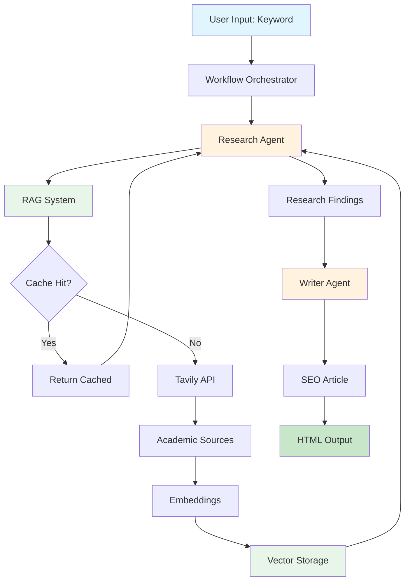
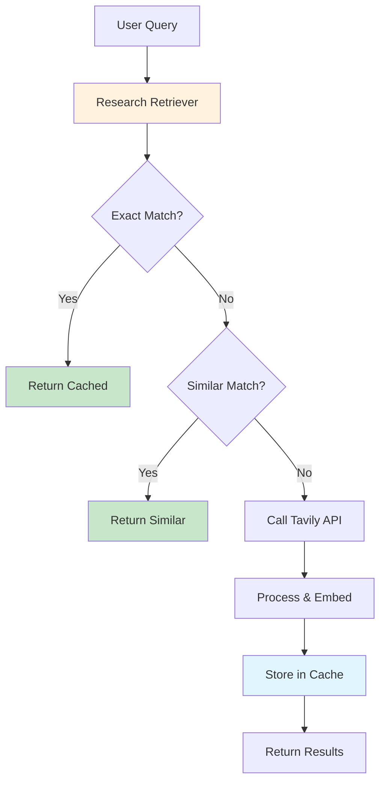

# SEO Content Automation System

An intelligent content generation pipeline that researches keywords using academic sources and produces SEO-optimized articles ready for human review. Built with PydanticAI for structured AI outputs and async Python for efficient API integration.


## 🎯 Project Overview

This system automates the content creation workflow by:
1. **Researching** keywords using academic sources via Tavily API
2. **Analyzing** credible sources with structured AI agents
3. **Generating** SEO-optimized articles based on research findings
4. **Producing** HTML drafts with metadata for human review

The project emphasizes code quality, error handling, and modular design while serving as a learning platform for async Python and AI agent development.

## 🏗️ Architecture



### Key Components

- **Research Agent**: Uses PydanticAI to analyze academic sources and extract key insights
- **Writer Agent**: Transforms research into SEO-optimized content with proper structure
- **RAG System**: Intelligent caching layer with semantic search capabilities
  - Three-tier caching: exact match → semantic similarity → fresh API call
  - Vector embeddings for semantic search using OpenAI's text-embedding-3-small
  - Supabase with pgvector for scalable vector storage
- **Workflow Orchestrator**: Manages the pipeline and handles errors gracefully
- **Tavily Integration**: Provides access to academic and credible web sources
- **Output Manager**: Generates organized HTML drafts with research metadata

## 🚀 Quick Start

### Prerequisites

- Python 3.11 or higher
- API Keys:
  - [Tavily API Key](https://tavily.com) for web search
  - [OpenAI API Key](https://platform.openai.com) for content generation

### Installation

1. **Clone the repository**
   ```bash
   git clone https://github.com/yourusername/seo-content-automation.git
   cd seo-content-automation
   ```

2. **Create a virtual environment**
   ```bash
   python -m venv venv
   source venv/bin/activate  # On Windows: venv\Scripts\activate
   ```

3. **Install dependencies**
   ```bash
   pip install -r requirements.txt
   ```

4. **Configure environment variables**
   ```bash
   cp .env.example .env
   # Edit .env with your API keys
   ```

5. **Run your first generation**
   ```bash
   python main.py generate "blood sugar management"
   ```

## 📋 Configuration

### Environment Variables

Create a `.env` file in the project root:

```env
# Required API Keys
TAVILY_API_KEY=your_tavily_api_key_here
OPENAI_API_KEY=your_openai_api_key_here

# Output Configuration (Optional)
OUTPUT_DIR=./drafts              # Where to save generated articles
LOG_LEVEL=INFO                   # DEBUG, INFO, WARNING, ERROR
MAX_RETRIES=3                    # Number of retry attempts for API calls
REQUEST_TIMEOUT=30               # Timeout in seconds for API requests

# Model Configuration (Optional)
LLM_MODEL=gpt-4                  # OpenAI model to use

# Tavily Search Configuration (Optional)
TAVILY_SEARCH_DEPTH=advanced     # basic or advanced
TAVILY_MAX_RESULTS=10            # Maximum search results (1-20)
TAVILY_INCLUDE_DOMAINS=.edu,.gov,.org  # Prioritized domains
```

### Configuration Details

| Variable | Required | Default | Description |
|----------|----------|---------|-------------|
| `TAVILY_API_KEY` | ✅ | - | Your Tavily API key for web search |
| `OPENAI_API_KEY` | ✅ | - | Your OpenAI API key for content generation |
| `OUTPUT_DIR` | ❌ | `./drafts` | Directory for saving articles |
| `LOG_LEVEL` | ❌ | `INFO` | Logging verbosity |
| `MAX_RETRIES` | ❌ | `3` | API retry attempts |
| `REQUEST_TIMEOUT` | ❌ | `30` | API timeout in seconds |
| `LLM_MODEL` | ❌ | `gpt-4` | OpenAI model selection |
| `TAVILY_SEARCH_DEPTH` | ❌ | `advanced` | Search comprehensiveness |
| `TAVILY_MAX_RESULTS` | ❌ | `10` | Number of search results |
| `TAVILY_INCLUDE_DOMAINS` | ❌ | `.edu,.gov,.org` | Preferred source domains |

### Getting API Keys

1. **Tavily API Key**
   - Sign up at [tavily.com](https://tavily.com)
   - Navigate to API Keys section
   - Copy your API key

2. **OpenAI API Key**
   - Create account at [platform.openai.com](https://platform.openai.com)
   - Go to API Keys section
   - Generate new secret key
   - **Important**: Save immediately (shown only once)

## 🗄️ Database Setup & RAG System (Phase 7)

The system includes a sophisticated Research Augmented Generation (RAG) system with intelligent caching and semantic search capabilities using Supabase with pgvector.

### 🚀 RAG System Features

- **Three-Tier Caching**: Exact match → Semantic similarity → Fresh API call
- **Cost Reduction**: ~40-60% reduction in API costs through intelligent caching
- **Fast Retrieval**: <1 second response time for cached queries
- **Semantic Search**: Find related research using vector embeddings
- **Smart Deduplication**: Avoid storing duplicate research

### Supabase Setup

1. **Create a Supabase Project**
   - Sign up at [supabase.com](https://supabase.com)
   - Create a new project
   - Note your project URL and service role key

2. **Initialize the Database**
   
   Run the SQL scripts in order:
   ```bash
   # In Supabase SQL Editor, run each script:
   
   # 1. Enable extensions and create base types
   sql/init_database.sql
   
   # 2. Create research storage with vector embeddings
   sql/research_documents.sql
   
   # 3. Set up source credibility tracking
   sql/research_metadata.sql
   
   # 4. Create cache for API responses
   sql/research_cache.sql
   
   # 5. Track generated articles
   sql/generated_articles.sql
   
   # 6. Placeholder for future Drive integration
   sql/drive_documents.sql
   ```

3. **Configure Environment Variables**
   
   Add to your `.env` file:
   ```env
   # Supabase Configuration
   SUPABASE_URL=your_project_url
   SUPABASE_SERVICE_KEY=your_service_key
   
   # RAG Configuration
   EMBEDDING_MODEL_NAME=text-embedding-3-small
   EMBEDDING_BATCH_SIZE=100
   EMBEDDING_DIMENSIONS=1536
   
   # Cache Settings
   CACHE_SIMILARITY_THRESHOLD=0.8
   CACHE_TTL_DAYS=7
   
   # Text Processing
   CHUNK_SIZE=1000
   CHUNK_OVERLAP=200
   
   # Performance
   CONNECTION_POOL_MIN=1
   CONNECTION_POOL_MAX=10
   ```

### 🔍 Cache Management Commands

The system includes powerful CLI commands for managing the research cache. For a comprehensive guide, see [Cache Management User Guide](docs/cache-management-guide.md).

#### Search the Cache
Find cached research similar to your query:
```bash
# Basic search
python main.py cache search "blood sugar management"

# Show more results
python main.py cache search "insulin resistance" --limit 20

# Adjust similarity threshold (stricter matching)
python main.py cache search "diabetes" --threshold 0.9
```

#### View Cache Statistics
Monitor cache performance and usage:
```bash
# Show cache statistics
python main.py cache stats

# Example output:
# 📊 Cache Statistics:
#   • Total entries: 156
#   • Cache size: 12.4 MB
#   • Average age: 3.2 days
#   • Hit rate: 67.8%
#   • Cost savings: $24.56
```

#### Clear Old Cache Entries
Maintain cache health by removing old entries:
```bash
# Clear entries older than 30 days
python main.py cache clear --older-than 30

# Preview what would be cleared (dry run)
python main.py cache clear --older-than 7 --dry-run

# Clear by keyword pattern
python main.py cache clear --keyword "outdated topic"
```

#### Pre-populate Cache
Warm the cache with anticipated searches:
```bash
# Research and cache without generating article
python main.py cache warm "future trending topic"

# Warm multiple keywords
python main.py cache warm "keto diet" "intermittent fasting" "low carb"
```

### RAG Architecture



### Database Features

- **Semantic Search**: Find similar research using vector embeddings
- **Exact Cache**: Reduce API calls for repeated searches
- **Source Tracking**: Monitor credibility and usage of sources
- **Quality Metrics**: Track article performance and SEO scores
- **Cost Analytics**: Track API usage and savings
- **TTL Management**: Automatic expiration of old cache entries

### Performance Optimization

The RAG system includes several optimizations:
- **Connection Pooling**: Reuse database connections efficiently
- **Batch Processing**: Process embeddings in batches
- **In-Memory Caching**: Cache embeddings during processing
- **Async Operations**: Non-blocking database queries

### Maintenance

```bash
# Clean expired cache entries (run periodically)
SELECT cleanup_expired_research_cache(30);

# Get cache statistics
SELECT * FROM get_cache_statistics();

# Check research diversity for a keyword
SELECT * FROM analyze_source_diversity('your-keyword');

# Monitor cache performance
SELECT * FROM cache_performance_metrics();
```

## 📁 Google Drive Integration

The system includes automatic Google Drive integration for backing up generated articles and organizing your content library.

### Drive Features

- **Automatic Upload**: Articles are automatically uploaded to Google Drive after generation
- **Document Conversion**: HTML articles are converted to Google Docs format
- **Folder Organization**: Articles are organized by date (Year/Month/Day)
- **Metadata Tracking**: Keywords, sources, and SEO metrics are attached to documents
- **OAuth Authentication**: Secure authentication using Google OAuth 2.0

### Setting Up Google Drive

1. **Create Google Cloud Project**
   - Go to [Google Cloud Console](https://console.cloud.google.com)
   - Create a new project or select existing one
   - Note the project ID

2. **Enable Google Drive API**
   - Navigate to "APIs & Services" > "Library"
   - Search for "Google Drive API"
   - Click "Enable"

3. **Create OAuth 2.0 Credentials**
   - Go to "APIs & Services" > "Credentials"
   - Click "Create Credentials" > "OAuth client ID"
   - Choose "Desktop app" as application type
   - Download the credentials as `credentials.json`
   - Place it in your project root directory

4. **Configure OAuth Consent Screen**
   - Go to "APIs & Services" > "OAuth consent screen"
   - Choose "External" user type (for personal use)
   - Fill in required fields (app name, email)
   - Add your email as a test user
   - Add scopes: 
     - `https://www.googleapis.com/auth/drive.file`
     - `https://www.googleapis.com/auth/drive.metadata.readonly`

5. **Add Environment Variables**
   ```env
   # Google Drive Configuration
   GOOGLE_DRIVE_CREDENTIALS_PATH=credentials.json
   GOOGLE_DRIVE_TOKEN_PATH=token.json
   GOOGLE_DRIVE_UPLOAD_FOLDER_ID=your_folder_id  # Optional: specific folder for uploads
   
   # RAG Drive Settings
   GOOGLE_DRIVE_ENABLED=true
   GOOGLE_DRIVE_AUTO_UPLOAD=true
   ```

6. **Authenticate with Drive**
   ```bash
   # First-time authentication
   python main.py drive auth
   
   # This will open a browser for OAuth authorization
   # The token will be saved for future use
   ```

### Drive CLI Commands

#### Authentication
```bash
# Authenticate with Google Drive
python main.py drive auth

# Check authentication status
python main.py drive status
```

#### Manual Upload
```bash
# Upload a specific article
python main.py drive upload ./drafts/keyword_20250107/article.html

# Upload with custom title
python main.py drive upload article.html --title "My SEO Article"

# Upload to specific folder
python main.py drive upload article.html --folder "2025/01/Articles"
```

#### List and Manage
```bash
# List uploaded articles
python main.py drive list

# Show more results
python main.py drive list --limit 50

# Export as JSON
python main.py drive list --json > uploads.json

# Check sync status with details
python main.py drive status --detailed
```

### Automatic Upload Workflow

When enabled, the system automatically:
1. Generates the article locally
2. Uploads to Google Drive as a Google Doc
3. Organizes in date-based folders
4. Attaches metadata (keyword, sources, metrics)
5. Tracks upload status in the database

### Troubleshooting Drive Issues

**Authentication Errors**
- Ensure `credentials.json` exists in project root
- Check that OAuth consent screen is configured
- Verify you're using the correct Google account

**Upload Failures**
- Check Drive storage quota
- Verify folder permissions
- Review API rate limits (usually not an issue)

**Token Expiration**
- Run `python main.py drive auth` again
- Token auto-refreshes in most cases

## 💻 Usage

### Command Overview

```bash
python main.py --help  # Show all available commands
```

### Basic Article Generation

Generate an article for a single keyword:
```bash
python main.py generate "ketogenic diet benefits"
```

### Advanced Options

```bash
# Research only (no article generation)
python main.py generate "intermittent fasting" --dry-run

# Verbose output with debug information
python main.py generate "protein synthesis" --verbose

# Quiet mode (only output file path)
python main.py generate "muscle building" --quiet

# Custom output directory
python main.py generate "insulin resistance" -o ./my-articles

# Combine multiple options
python main.py generate "blood sugar" -o ./output --verbose
```

### Batch Processing

Process multiple keywords efficiently with optional parallel execution:

```bash
# Process multiple keywords sequentially
python main.py batch "keto diet" "intermittent fasting" "low carb"

# Process 3 keywords in parallel for faster results
python main.py batch "diabetes" "insulin" "blood sugar" --parallel 3

# Continue processing even if some keywords fail
python main.py batch "topic1" "topic2" "topic3" --continue-on-error

# Research only mode for all keywords
python main.py batch "keyword1" "keyword2" --dry-run

# Custom output directory for batch
python main.py batch "seo1" "seo2" "seo3" -o ./batch-output

# Disable progress bar for automation
python main.py batch "topic1" "topic2" --no-progress
```

#### Batch Processing Tips
- Use `--parallel 2-3` for optimal performance without hitting rate limits
- Add `--continue-on-error` for resilient batch processing
- Monitor API rate limits when processing many keywords
- Results summary shows successful and failed generations

### Configuration Management

```bash
# Check if configuration is valid
python main.py config --check

# Show current configuration
python main.py config --show

# Test your setup with a sample generation
python main.py test
```

### Maintenance Commands

```bash
# Clean up old workflow files
python main.py cleanup

# Clean files older than 48 hours
python main.py cleanup --older-than 48

# Preview what would be cleaned (dry run)
python main.py cleanup --dry-run
```

### Output Structure

Each generation creates a timestamped directory:
```
drafts/
└── blood_sugar_management_20240115_143022/
    ├── index.html        # Review interface
    ├── article.html      # Generated article
    └── research.json     # Research metadata
```

## 🧩 Project Structure

```
seo_content_automation/
├── main.py              # CLI entry point with cache commands
├── config.py            # Configuration management
├── workflow.py          # Pipeline orchestration
├── research_agent/      # Research agent module
│   ├── agent.py        # Agent implementation
│   ├── tools.py        # Tavily API integration with RAG
│   └── prompts.py      # Research prompts
├── writer_agent/        # Writer agent module
│   ├── agent.py        # Agent implementation
│   └── prompts.py      # Writing prompts
├── rag/                 # RAG system components
│   ├── config.py       # RAG configuration
│   ├── processor.py    # Text chunking and processing
│   ├── embeddings.py   # OpenAI embeddings generation
│   ├── storage.py      # Supabase vector storage
│   └── retriever.py    # Cache retrieval orchestration
├── prompts/             # Prompt templates
│   └── article_template.txt
├── drafts/              # Generated articles
├── tests/               # Comprehensive test suite
│   └── test_rag/       # RAG component tests
└── docs/                # Additional documentation
```

## 🛠️ Development

### Running Tests

```bash
# Run all tests
pytest

# Run with coverage
pytest --cov=.

# Run specific test file
pytest tests/test_agents.py
```

### Code Style

The project uses:
- Black for code formatting
- isort for import sorting
- mypy for type checking

```bash
# Format code
black .
isort .

# Type check
mypy .
```

### Adding New Features

1. Create a feature branch
2. Implement with tests
3. Update documentation
4. Submit pull request

## 📊 Example Output

The system generates comprehensive articles with:
- SEO-optimized title and meta description
- Structured content with proper headings
- Academic source citations
- 1,500-2,500 word count
- HTML formatting ready for CMS

## 🐛 Troubleshooting

### Common Issues

#### API Key Errors
```
❌ Configuration error: tavily_api_key cannot be empty
```
**Solution:**
- Verify `.env` file exists in project root
- Check API keys are correctly set without quotes
- Ensure no spaces around the `=` sign
- Verify API key format (usually 32+ characters)

#### Network Timeouts
```
TimeoutError: Request timed out after 30 seconds
```
**Solution:**
- Increase timeout: `REQUEST_TIMEOUT=60` in `.env`
- Check internet connection stability
- Verify API service status at:
  - Tavily: https://status.tavily.com
  - OpenAI: https://status.openai.com

#### No Academic Sources Found
```
ValueError: No academic sources found in research results
```
**Solution:**
- Try broader or more common keywords
- Remove special characters from keywords
- Check `TAVILY_INCLUDE_DOMAINS` setting
- Try with `TAVILY_SEARCH_DEPTH=advanced`

#### Insufficient Research Quality
```
Warning: Only found 2 sources, below recommended minimum of 3
```
**Solution:**
- Use more specific academic terms
- Try alternative keyword variations
- Increase `TAVILY_MAX_RESULTS` to 20

#### Rate Limiting
```
TavilyRateLimitError: API rate limit exceeded
```
**Solution:**
- Wait before retrying (usually 60 seconds)
- Reduce concurrent requests
- Check your API plan limits

### Debug Mode

Enable detailed logging for troubleshooting:
```bash
# Set in .env file
LOG_LEVEL=DEBUG

# Or use verbose flag
python main.py generate "your keyword" --verbose
```

### Environment Issues

#### Virtual Environment Not Activated
```
ModuleNotFoundError: No module named 'pydantic_ai'
```
**Solution:**
```bash
# Activate virtual environment
source venv/bin/activate  # Linux/Mac
venv\Scripts\activate     # Windows
```

#### Python Version Issues
```
SyntaxError: invalid syntax
```
**Solution:**
- Ensure Python 3.11+ is installed
- Check version: `python --version`
- Use `python3` if needed

### File System Issues

#### Permission Denied
```
PermissionError: [Errno 13] Permission denied
```
**Solution:**
- Check write permissions for output directory
- Run with appropriate user permissions
- Ensure `OUTPUT_DIR` is writable

#### Disk Space
```
OSError: [Errno 28] No space left on device
```
**Solution:**
- Check available disk space
- Clean old outputs: `python main.py cleanup`
- Change `OUTPUT_DIR` to different drive

### Getting Help

If issues persist:
1. Check existing [GitHub Issues](https://github.com/yourusername/seo-content-automation/issues)
2. Enable debug logging and save output
3. Create new issue with:
   - Error message
   - Debug logs
   - Python version
   - OS information
   - Steps to reproduce

## 🤝 Contributing

We welcome contributions! Please:
1. Fork the repository
2. Create a feature branch
3. Add tests for new functionality
4. Ensure all tests pass
5. Submit a pull request

## 📚 Learning Resources

This project is designed as a learning platform for:
- **Async Python**: Master async/await patterns
- **PydanticAI**: Structured AI agent development
- **API Integration**: Best practices for external services
- **Error Handling**: Graceful degradation strategies
- **Testing**: Comprehensive test coverage

### 📖 Additional Guides
- [Cache Management Guide](docs/cache-management-guide.md) - Complete guide to using the RAG cache system
- [Performance Tuning Guide](docs/performance-tuning-guide.md) - Optimize for speed, cost, and efficiency

## 🔮 Future Enhancements

### Recently Completed (Phase 7.2)
- [x] RAG system with intelligent caching
- [x] Semantic search capabilities
- [x] Cache management CLI commands
- [x] Cost reduction through caching (~40-60%)
- [x] Vector embeddings with pgvector

### Upcoming Features
- [ ] Batch keyword processing
- [ ] WordPress integration
- [ ] Web UI with Streamlit
- [ ] Multi-language support
- [ ] SEO scoring metrics
- [ ] Content scheduling
- [ ] Real-time cache analytics dashboard
- [ ] Hybrid search (vector + keyword)
- [ ] Knowledge graph visualization

## 📄 License

This project is licensed under the MIT License - see the [LICENSE](LICENSE) file for details.

## 🙏 Acknowledgments

- Built with [PydanticAI](https://ai.pydantic.dev/) for structured AI outputs
- Powered by [Tavily API](https://tavily.com) for academic research
- Uses [OpenAI](https://openai.com) for content generation

## 📞 Support

- Create an [issue](https://github.com/yourusername/seo-content-automation/issues) for bugs
- Check [PLANNING.md](PLANNING.md) for architecture details
- Review [TASKS.md](TASKS.md) for development roadmap

---

*Built with ❤️ for content creators who value quality and efficiency*