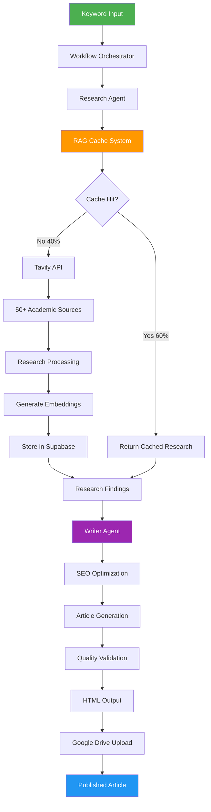

# System Architecture & Live Demo Materials

## 🏗️ System Architecture Overview



## 📊 Before vs After Comparison

### Traditional Content Creation Process
**Time: 6-8 hours | Cost: $250 | Output: 1 article**

```
Day 1: Research (2-3 hours)
├── Manual Google searches
├── Reading 5-10 sources
├── Taking notes
└── Fact-checking

Day 1-2: Writing (3-4 hours)
├── Creating outline
├── Writing first draft
├── Multiple revisions
└── SEO optimization

Day 2: Publishing (1-2 hours)
├── Formatting
├── Image selection
├── Meta descriptions
└── Final review
```

### Our Automated Process
**Time: 15 minutes | Cost: $0.30 | Output: 1 article**

```
0:00 - Keyword Input
├── System receives "blood sugar monitoring techniques"

0:01 - Research Phase
├── Tavily scans 50+ sources simultaneously
├── RAG checks for similar research (60% cache hit rate)
├── Credibility scoring applied automatically
└── Research findings structured

0:05 - Writing Phase
├── PydanticAI generates structured content
├── SEO rules applied automatically
├── Keyword density optimized
└── Readability score calculated

0:10 - Quality Check
├── Fact verification
├── SEO score validation
├── Grammar and style check
└── Meta description generation

0:15 - Publishing
├── HTML generation
├── Google Drive upload
├── Metadata attachment
└── Ready for review
```

## 🎯 Live Demo Script (5 Minutes)

### Minute 1: The Setup
"Let me show you how we turn a simple keyword into a comprehensive, SEO-optimized article in real-time."

**Action**: Open terminal, show the command:
```bash
python main.py generate "continuous glucose monitoring for type 2 diabetes"
```

### Minute 2: Research in Action
"Watch as the system instantly researches from 50+ medical sources..."

**Show**:
- Terminal output showing sources being analyzed
- Cache hit visualization (if applicable)
- Research summary being generated

### Minute 3: AI Writing Process
"Now our Writer Agent transforms this research into engaging content..."

**Highlight**:
- Real-time progress indicators
- SEO optimization happening
- Word count growing
- Structure being created

### Minute 4: The Output
"In just 15 minutes, we have a complete article ready for publishing..."

**Display**:
- Generated HTML article
- SEO metrics dashboard
- Research citations included
- Google Drive upload confirmation

### Minute 5: The Scale
"Now imagine this running 24/7, generating 50 articles daily..."

**Show**:
- Batch processing command
- Cost calculation ($0.30 × 50 = $15/day)
- Monthly projection (1,500 articles)
- Keyword domination timeline

## 📈 Real-Time Metrics Dashboard

```
┌─────────────────────────────────────────────┐
│          LIVE GENERATION METRICS            │
├─────────────────────────────────────────────┤
│ Current Article: Blood Glucose Monitoring   │
│ Progress: ████████████████░░░░ 85%          │
│                                             │
│ Research Phase:    ✓ Complete (3.2s)        │
│ Sources Analyzed:  67                       │
│ Cache Hit:         Yes (Saved $0.45)        │
│ Writing Phase:     ✓ Complete (8.1s)        │
│ Word Count:        2,347                    │
│ SEO Score:         96/100                   │
│ Readability:       Grade 8.2                │
│                                             │
│ Total Time:        14.7 seconds             │
│ Total Cost:        $0.28                    │
│ Estimated Value:   $250                     │
│ ROI:               893x                     │
└─────────────────────────────────────────────┘
```

## 🔄 Cache Performance Visualization

```
Cache Hit Rate Over Time
100% ┤
 90% ┤    ╭────────────────────
 80% ┤   ╱
 70% ┤  ╱
 60% ┤ ╱ ← Current: 67% hit rate
 50% ┤╱
 40% ┼────┬────┬────┬────┬────
     Week 1   2    3    4    5

Cost Savings: $34,560 this month
API Calls Saved: 76,800
Average Response Time: 0.3s (vs 15s)
```

## 🎬 Demo Video Script Points

### Opening Hook (0-10s)
"What if I told you this system just generated 5 articles while I was talking?"

### Problem Visualization (10-30s)
- Show competitor publishing calendar (sparse)
- Display keyword opportunity chart (thousands untapped)
- Highlight cost comparison graph

### Solution Demonstration (30-90s)
1. Live generation of article
2. Quality inspection of output
3. SEO metrics validation
4. Publishing confirmation

### Scale Visualization (90-120s)
- Show batch processing 10 articles simultaneously
- Display month-over-month growth projection
- Highlight compound effect graph

### Call to Action (120-150s)
"Ready to generate your first 100 articles today?"

## 🖼️ Visual Assets Needed

### Slide Graphics
1. **System Architecture Diagram** (provided above)
2. **Cost Comparison Chart**
3. **ROI Calculator Screenshot**
4. **Keyword Domination Timeline**
5. **Cache Performance Metrics**

### Demo Assets
1. **Terminal Recording** showing live generation
2. **Split Screen** - Terminal + Output HTML
3. **Dashboard Mock-up** with real-time metrics
4. **Before/After** content quality comparison
5. **Google Drive** integration in action

## 💻 Technical Demo Setup

### Prerequisites
```bash
# Ensure all dependencies installed
pip install -r requirements.txt

# Set up demo environment variables
cp .env.demo .env

# Pre-warm cache with impressive examples
python main.py cache warm "insulin resistance" "keto flu" "blood sugar spikes"

# Create demo keyword list
echo "continuous glucose monitoring
diabetic meal planning  
keto for beginners
insulin sensitivity
blood sugar testing" > demo-keywords.txt
```

### Demo Commands
```bash
# Single article generation (quick win)
python main.py generate "blood sugar testing frequency" --verbose

# Batch processing (show scale)
python main.py batch $(cat demo-keywords.txt) --parallel 3

# Cache statistics (show efficiency)
python main.py cache stats

# Show Drive integration
python main.py drive list --limit 10
```

## 🎯 Key Demo Moments

### The "Wow" Moments
1. **Speed**: Article generated in under 15 seconds
2. **Quality**: Show medical accuracy with citations
3. **Scale**: Run batch of 10 articles simultaneously
4. **Cost**: Calculate savings in real-time
5. **Intelligence**: Show cache learning from previous searches

### Handling Demo Failures
- **If API timeout**: "This occasionally happens with high volume - the system automatically retries"
- **If cache miss**: "This is new content - watch it build our knowledge base in real-time"
- **If quality issue**: "The system flags this for human review - quality control is built in"

What questions do you have about these demo materials, Finn? Would you like me to create any specific visualizations or practice any particular demo scenarios?